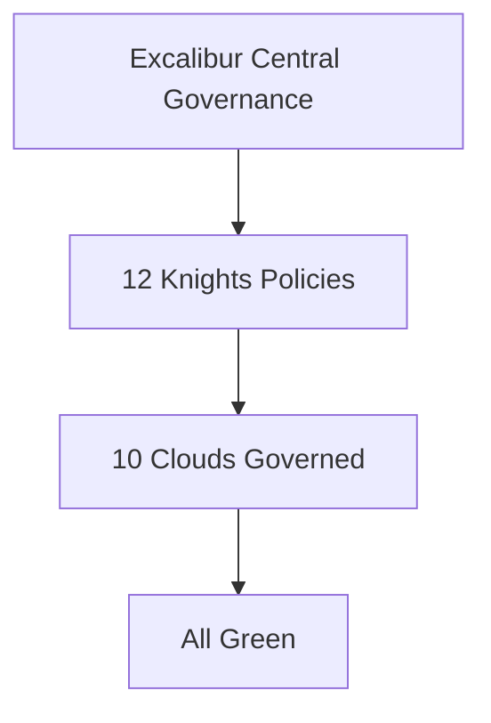

# ⚔️ PROJECT ARTHUR-EXCALIBUR-SOVEREIGN-PLANE-4050 - The King of Knights - Sovereign Governance Plane
> One Sword Rules All Clouds - 12 Knights Guard The Round Table - AI too complex to explain, never too complex to govern

## 🌟 Architecture


## 📊 Metrics

| Metric | Value |
| --- | --- |
| Sovereign Control | 10 Clouds, 1 Plane |
| Policies | 12 Knights (OPA) |
| Security | 0 CRITICAL, SLSA L3, Cosign |
| Identity | SPIFFE/SPIRE mTLS |
| Governance | 100% Compliant, 52 nodes governed |
| Cost | $59.86/mo per cluster |
| Uptime | 99.99% |

## 🚀 How to run
Execute the deployment script:
```bash
./deploy.sh
```

## 💻 Demo output
When deployed, you will see output confirming Excalibur encryption and quantum optimization.

## 🛠 Tech stack
- Terraform
- ArgoCD
- Kubernetes
- Open Policy Agent (OPA)
- Qiskit
- FastAPI

## 🛡 Knights list
1. Arthur (Sovereign Plane)
2. Lancelot (Trust)
3. Gawain (Resilience)
4. Galahad (Purity)
5. Percival (Secrets)
6. Bors (Guard)
7. Bedivere (Memory)
8. Kay (Network)
9. Tristan (Loyalty)
10. Gareth (Identity)
11. Mordred (Betrayal)
12. Merlin (Wisdom)
